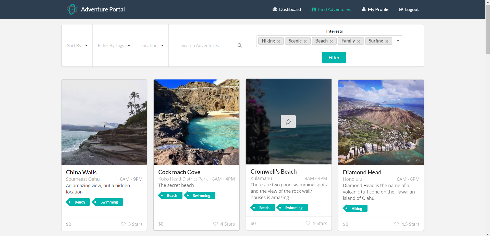

<!--

  
  
  
  

-->

### Project Overview
Working in a team of three University of Hawaii computer engineering undergraduate students, we built a web application, Adventure Portal. [Click here](https://adventure-portal.github.io/) to see the team’s project page. 
The problem that the app seeks to solve is that it is often difficult for individuals to organize and find activities with other people who share the same interests. The idea behind Adventure Portal was to create an application that helps individuals explore new activities by having a platform to easily organize acitives activiites with similar minded people. It allows individuals who have an interesting activity to share or want to find something new to connect with people who share the same passion based on shared interests. 
Some of the use cases include:
<ul>
<li>Creating profiles that pin favorited activities</li>
<li>Creating adventures that other people can browse and join</li>
<li>Searching for adventures based on interests</li>
</ul>
Below is a screen capture of the project home page which has a list of featured adventures:

### Meteor Application Development
The application was built using the web application framework, Meteor. I was primarly responsible for designing the layout of pages which included UI, routing, user authentication, and authorization. In order to create these pages, the team used HTML, Semantic UI, JavaScript and some CSS. Our team used Git and Github for version control to improve the efficiency with which we were able to test and develop code. I designed the layout for the landing page, dashboard page, browse adventures page, user profile page, 404 lost page, and not-authorized page. On these pages, I also implemented the functionality to filter and display data from various input fields to our database.
### Learning Outcomes
From this project, I learned both technical and project management skills. On the technical side, I became familiar with the Meteor application framework and strengthened my understanding of HTML and JavaScript. I also strengthened my skills involving Git and GitHub for version control. In terms of project management, I learned how to effectively break down tasks within a project to smaller incremental steps which we referred to as issues. In addition, I learned to create, assign, and manage issues for project milestones through Github. 

Source: <a href="https://github.com/adventure-portal/adventure-portal"><i class="large github icon"></i>adventure-portal </a>

