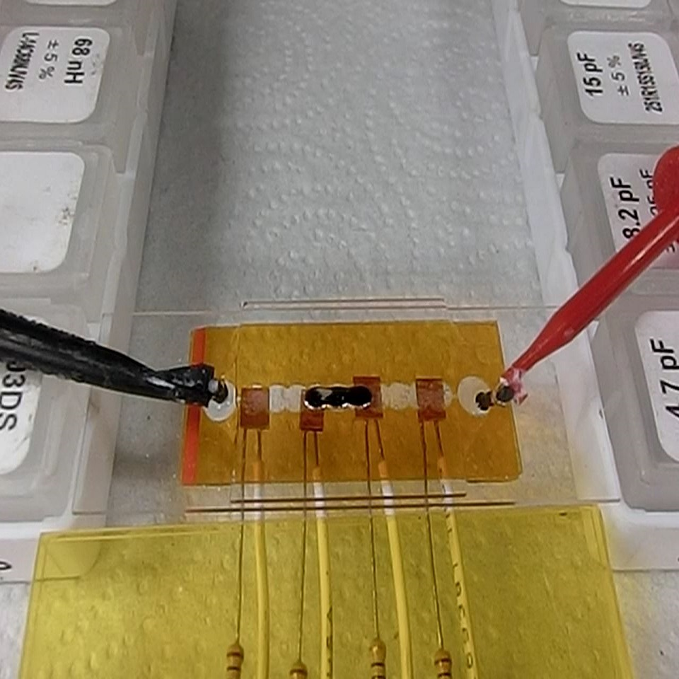
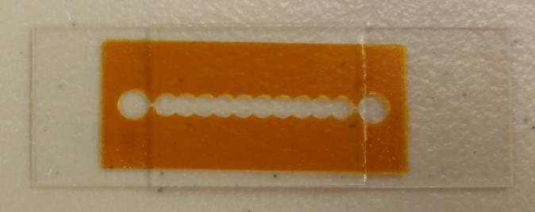
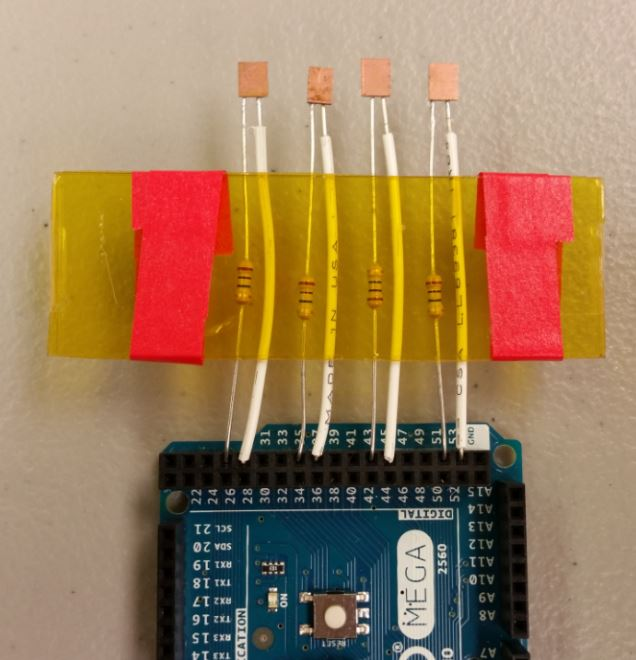
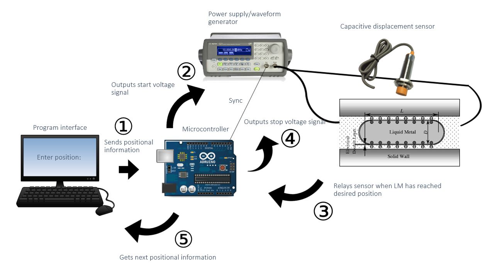

  
  
  
  

Continuous electrowetting (CEW) is an electromechanical response that can be used to alter the surface tension of liquid-metal droplets through the application of an electric potential. Galinstan, a liquid metal is injected into an electrolyte-filled channel and manually actuated. Although general control of liquid-metal slug locations has been demonstrated, pinpoint accuracy and automation has yet to be proven. Based on results from initial prototypes, this implementation demonstrates a CEW automation design concept to enable accurate positional control by utilizing a microcontroller and positional feedback sensors to directly improve liquid-metal device testing.

Continuous electrowetting automation is implemented using an [Arduino Mega](https://www.arduino.cc/en/Main/arduinoBoardMega2560) microcontroller, a open-source electronics platform, the [Agilent 33220A](http://www.keysight.com/en/pd-127539-pn-33220A/function-arbitrary-waveform-generator-20-mhz?cc=US&lc=eng) waveform generator, and home-made feedback displacement sensors made with [Duroid](http://www.rogerscorp.com/acs/producttypes/6/RT-duroid-Laminates.aspx) and resistors. Over a semester, firmware was developed which utilized feedback displacement sensors and the Arduino serial monitor to implement the process of CEW where the user can specify a desired position in the fluidic channel. 

In this project, I gained experience working with an Arduino microcontroller for its programming platform and serial interface, C++ for programming the functional abilities of the application, and the [CapacitiveSensor Library](https://github.com/PaulStoffregen/CapacitiveSensor) for handling the proximity sensing of capacitive displacement sensors.
 
Source Code: <a href="https://github.com/nathancy/LM-CEW-Automation-"><i class="large github icon"></i>https://github.com/nathancy/LM-CEW-Automation-</a>

