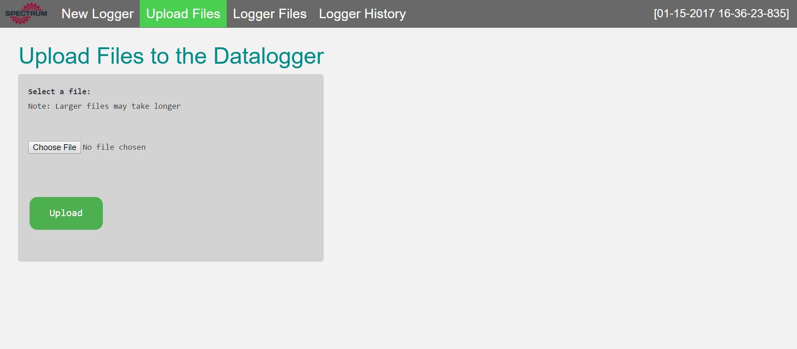
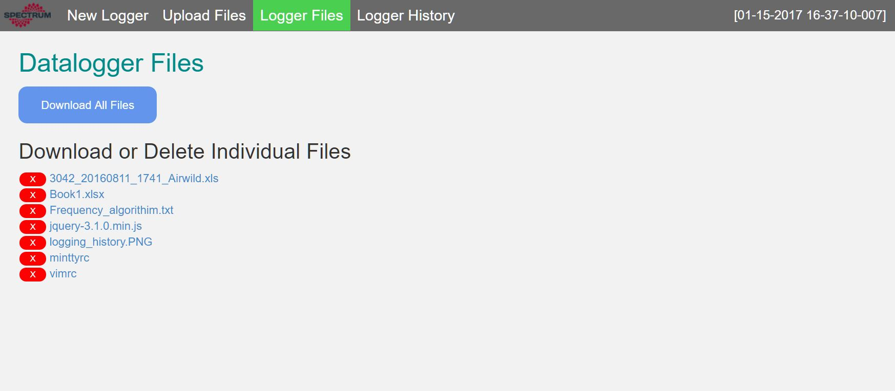
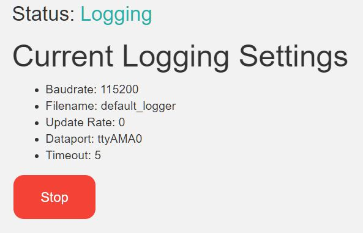
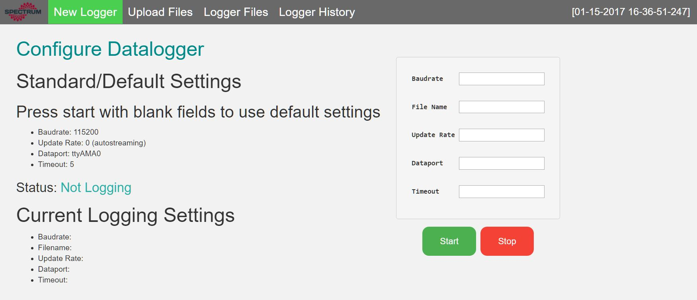

  
  
  

### Project Overview
A portable datalogger webserver capable of running on any local connection built using the [Django](https://www.djangoproject.com/) framework. Includes Python scripts to timestamp and log GPS data (or any data stream via UART) on a [Raspberry Pi](https://www.raspberrypi.org/) into .csv files. Implemented using fully customized HTML5/CSS web interface to create, edit, remove, or view logging data history. 

### Datalogger Features
* Ability to create new logger with specified and standard/default settings. Choose baudrate, desired .csv file name, data-stream update rate, port, and timeout.
* Dropbox-like file hosting capability.
* View, download, or delete individual files.
* Current logging status with ability to stop logger.

### Datalogger Development
The application was built using the Django web framework. As the sole developer for this project, I first wrote background Python scripts that imitated input from the command line. The scripts parsed values and used default values if no user specific settings were given. These arguments included the baudrate, update rate, file name, dataport, and timeout settings. From there, the script utilized the user input and outputted data to a .csv file with timestamps.

Afterwards, I setup the server by writing the backend for the datalogger. This included models, urls, forms, and views that controlled input settings, background processes, file management, and user interaction with various pages. In order to create the pages, I used Python for background processes, HTML/CSS for the interface, and some JavaScript for page appearance. Git and GitHub were also used for version control to improve the efficiency of testing and developing code. Version control served as a safety net for implementing new features without the fear of breaking the entire server. After implementing the basic features, I added logging statuses, simple file hosting, and logging history.

### Learning Outcomes
Since this project was built completely by me, I learned a LOT which included both technical and design skills. Before starting this project, I had no exposure to Python, HTML, CSS, JavaScript or any type of framework as I learned the syntax of each language on the fly. Afterwards, I became familiar with these languages and tools as implementing this project allowed me to learn additional programming languages. I also strengthened my skills in using Git and GitHub for version control. In terms of design skills, since this project was built completely from scratch, I learned how to implement features in small increments and learned how to effectively break down tasks into manageable sections. 

Source Code: <a href="https://github.com/nathancy/Datalogger-Server"><i class="large github icon "></i>https://github.com/nathancy/Datalogger-Server</a>

