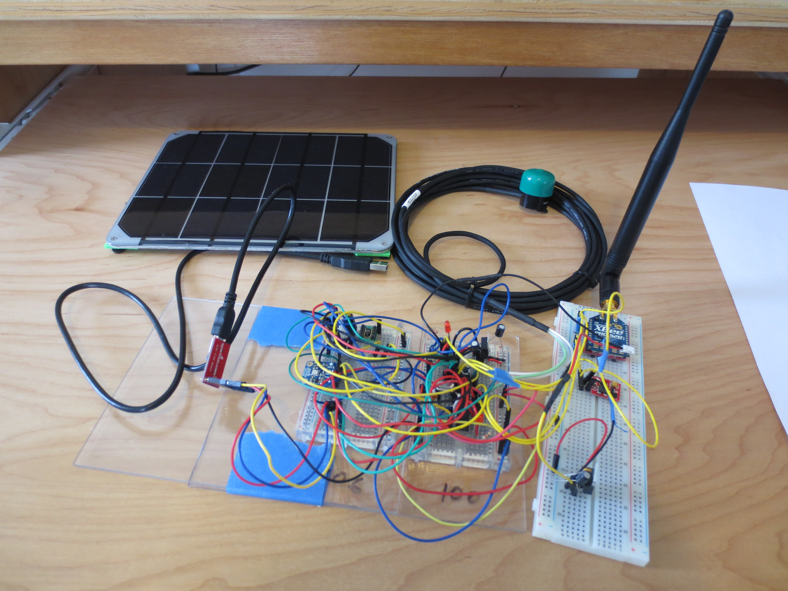
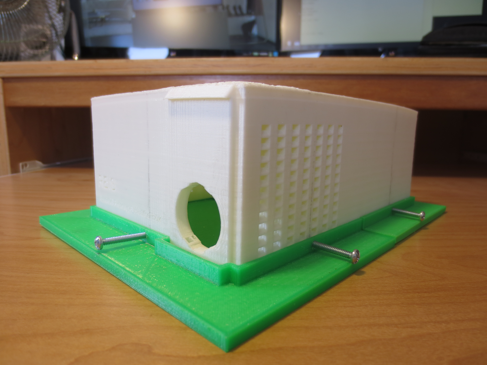

### Project Overview
The objective of this project is to design and develop low-cost, accurate, and reliable environmental sensor modules that can easily be reproduced for mass deployment on rooftops across the University of Hawaii at Manoa campus. The meteorological data collected from these modules will assist in planning future renewable energy installations as well as providing risk mitigation for electricity generation through the development of renewable resource prediction and forecasting algorithms.

By collecting solar irradiance, temperature, humidity, and pressure data of Hawaii's weather patterns, this weatherbox collects data which will be used to make Hawaii a more sustainable place to live in. One part of tackling this problem is creating a microgrid for UHM that is independent of Hawaii's grid. In order to accomplish this, we are looking to find optimal places on campus to install renewable energy sources, such as PV. To find these optimal places, this weatherbox was designed and built to collect reliable weather data that can be analyzed to forecast solar irradiation patterns.

### Requirements
* Weatherbox must collect solar irradiance, temperature, humidity, and pressure data.
* Utilize solar energy and function for 2 days without sunlight.
* Relay data wirelessly to a base node in organized format for the Gateway.
* Housing must be secured, waterproof, and designed in such a way that the internals can be accessed with relative ease.

### Specifications/Parts
* Microprocessor: [Atmel Atmega328P](http://www.atmel.com/images/atmel-8271-8-bit-avr-microcontroller-atmega48a-48pa-88a-88pa-168a-168pa-328-328p_datasheet_complete.pdf)
* Transceiver: [XBee Pro Series 2b -RPSMA](https://www.sparkfun.com/products/10419)
* Charging Circuit: [Adafruit 390](https://www.adafruit.com/products/390)
* Solar Panel: [Adafruit 1525](https://www.adafruit.com/products/1525)
* Battery: [Tenergy 18650 3.7V 6600mAh](https://cdn-shop.adafruit.com/product-files/353/C450_-_ICR18650_6600mAh_3.7V_20140729.pdf)
* Soalr Irradiance Sensor: [Apogee SP-215](http://www.apogeeinstruments.com/content/SP-212_215manual.pdf)
* Temperature Sensor: [Maxim DS18B20](https://www.maximintegrated.com/en/products/analog/sensors-and-sensor-interface/DS18B20.html)
    * [Temperature Sensor Library](https://github.com/milesburton/Arduino-Temperature-Control-Library)
    * [One Wire Library for Temperature Sensor](https://github.com/ntruchsess/arduino-OneWire)
* Humidity Sensor: [Sensirion SHT1x](https://cdn-shop.adafruit.com/datasheets/Sensirion_Humidity_SHT1x_Datasheet_V5.pdf)
    * [Humidity Sensor Library](https://github.com/practicalarduino/SHT1x)
* Pressure Sensor: [BMP180](https://www.adafruit.com/products/1603)
    * [Pressure Sensor Library](https://github.com/adafruit/Adafruit-BMP085-Library)

### Implementation
The weatherbox firmware can be split into two main sections: sensor module and transmit module. The sensor module is composed firmware that controls the solar irradiance, humidity, pressure, temperature, battery voltage, and solar panel voltage sensors. Similarly, the transmit module is composed of firmware that organizes the data obtained by the sensors into packets which is then sent to server that comprises the data into a database. A microcontroller periodically polls the sensors as the data the transmitted through a XBee to the Gateway where packets are decoded and finally to the database where the data is organized. The weatherbox is housed in a 3d printed box that protects the internal components from the environment. 

I lead the firmware development of the project, where my main focus was implementing the sensor and transmit modules between the weatherbox and the server. I used Arduino's serial monitor to verify correct sensor readings on the computer where it could then be processed and sent to the server.

### Learning Outcomes
This project provided a great opportunity to gain more experience with C++, microcontrollers, and embedded systems development.

For more information on the Smart Campus Energy Lab, vist this [webpage](http://scel-hawaii.org/).

Source Code: <a href="https://github.com/nathancy/Team-Asteroid"><i class="large github icon "></i>https://github.com/nathancy/Team-Asteroid</a>
